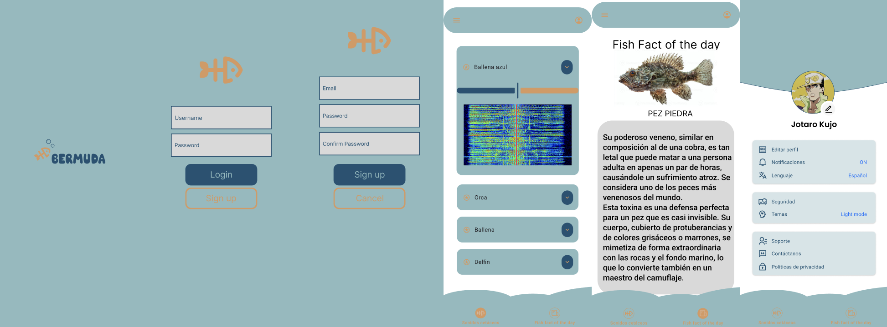

# Bermuda

## Descubre los secretos del océano

## Contenidos de la aplicación:
- Login básico.
- Dato diario sobre peces (Fish fact of the day).
- Sonidos cetáceos con espectrograma.

### Participantes:
- [@SpringIsKTho](https://github.com/SpringIsKTho)
- [@Gokirbyvan](https://github.com/Gokirbyvan)
- [@Zubillaga736](https://github.com/Zubillaga736)

## Capturas del prototipo en Figma:
