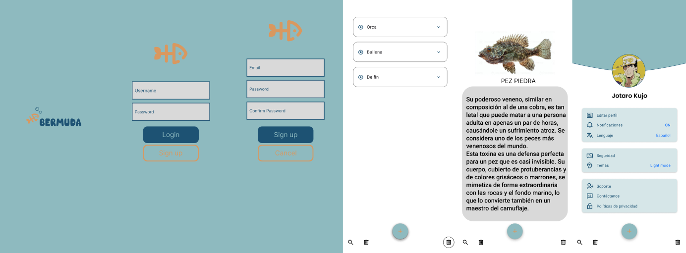

# Bermuda

## Descubre los secretos del océano

## Contenidos de la aplicación:
- Inicio de sesión y creación de cuentas.
- Subida de peces a una base de datos.
- Fotos (obligatorio) y audio (opcional).
- Cambio de idioma (inglés y español).

### Participantes:
- [@SpringIsKTho](https://github.com/SpringIsKTho)
- [@Gokirbyvan](https://github.com/Gokirbyvan)
- [@Zubillaga736](https://github.com/Zubillaga736)

## Capturas del prototipo en Figma:
